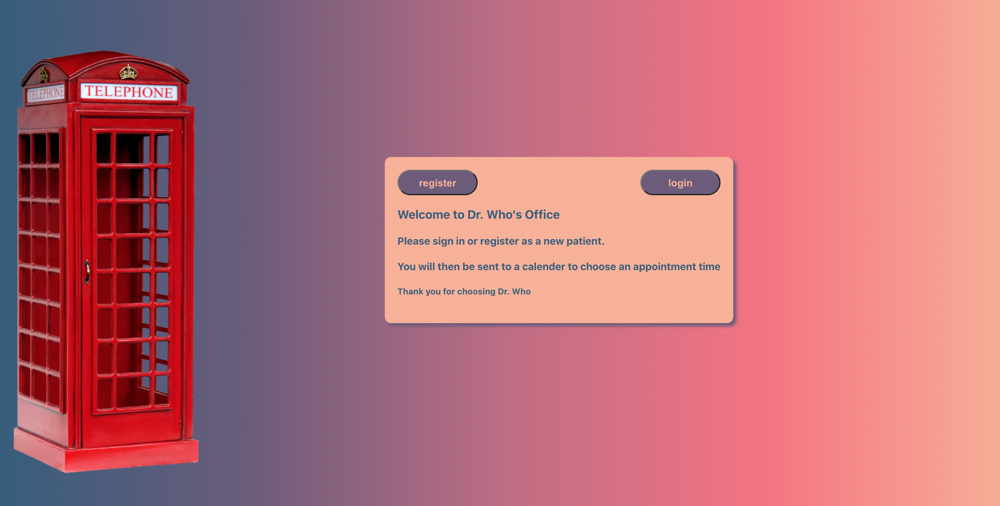
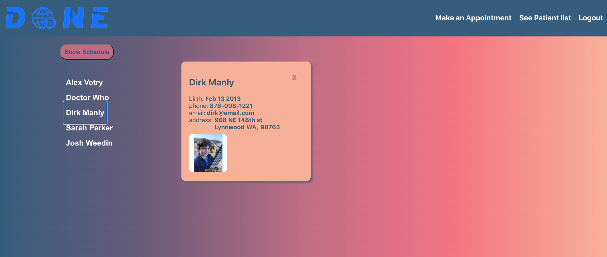

# Patient scheduler
To download this app:

`git clone https://github.com/AlexVotry/patientRegister.git`

in your **terminal**:

1. cd into client *folder* and type `npm install`
2. cd into the *server* folder and type `npm install`
3. in both *client* and *server* type `npm start` .

*This app connects to a mongodb in the cloud.*

*User can login or register.  The login is authenticated with passport-local-mongoose.*

### You can login as an administrator:
`email: drwho@email.com, pw: secret`

### or you can register using whatever info you like.

The Nav bar will send you to the scheduler or (if admin) the patient list.

The can choose on the calendar when to make an appointment. Other Appointments are visible.

This app fulfills these requirements:
Requirements​:
1. The patient has to submit their name, date of birth, phone number, email, address, photo (driver license) and appointment time to register.
2. The admin should be able to view all the registered patients from the website.

This was an exercise that I needed to finish in a couple days after work. 
Things I would've liked to do:
1. testing,
2. error handling,
3. validation of inputs,
4. editing and removing appointments,
5. editing and removing patients,
6. admins ability to add other admins,
7. use websocket for scheduling to be real-time,
8. put convert css into scss or inline styles,
9. improve the style of the calendar and the styles in general.

Thank you for taking the time to look. I currently have a full time job along with other commitments so spending 48hrs of my free time would be difficult to manage inside a week.

